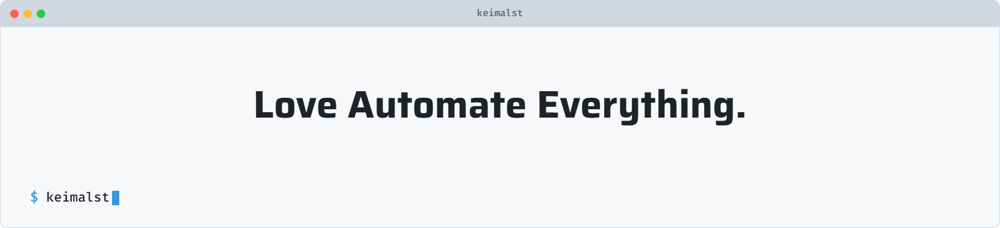

<picture>
   <source media="(prefers-color-scheme: dark)" srcset="header-dark.png">
   
</picture>

<h2> 👾 About Me </h2>
🎓 Information Systems student at Institut Teknologi Sepuluh Nopember  
🤖 Built 10+ automation systems eliminating 85%+ repetitive manual tasks  
⚙️ Designed structured workflows handling 10,000+ automated executions per week  
📈 Increased operational efficiency up to 3× through AI-driven automation  
🔥 Reduced process turnaround time by 70% via systemized digital infrastructure  

 

 

 

<h2 align="center"> Let’s Build Something Great! </h2>

  &nbsp;&nbsp;
  &nbsp;&nbsp;
  &nbsp;&nbsp;

